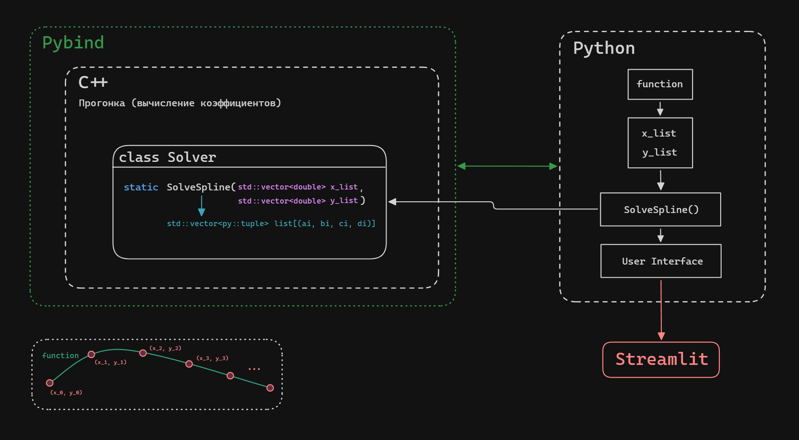

# Построение интерполирующего кубического сплайна

## Структура проекта

*Файловая структура*
```
+---includes
|       solver.h
|
+---python
|       main.py
|
+---src
|       main.cpp
|       solver.cpp
```

*Илюстрация архитектуры проекта*


---
## Инструкция по сборке

*Используемая версия Python:* **3.14**.

На Linux необходимо установить `dev` версию python:
```Shell
sudo apt install python3.14-dev
```

### 1. Создать виртуальное окружение
```Shell
py -m venv .venv
```

*Команда `py` может не работать на Linux.*
### 2. Активировать виртуальное окружение
```Shell
./.venv/Scripts/activate
```
### 3. Установить библиотеки
```Shell
pip install -r "requirements.txt"
```
### 4. Папка для сборки
```bash
mkdir build
cd build
```
### 5. Генерация файлов сборки
```bash
cmake .. 
```
### 6. Компиляция программы
```bash
cmake --build .
```

### Intellisense для Vs Code
Добавьте деректорию `./python` как дополнительный путь в `python.analysis.extraPaths`
```json
"python.analysis.extraPaths": ["${workspaceFolder}/python"]
```